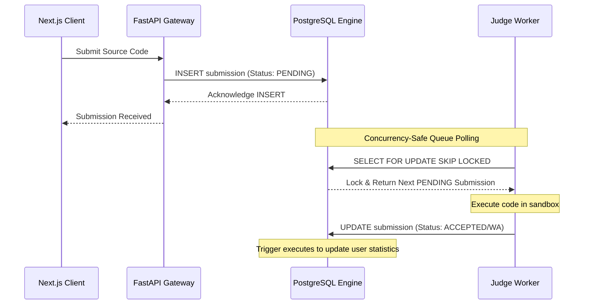

# ContestDB: A Database-Native Contest Judge

**ContestDB** is a database-native backend infrastructure for competitive programming platforms. Built as a proposal for the **CSE 4410: Database Management Systems II Lab** course , ContestDB challenges the traditional web development pattern of placing all business logic in application servers. Instead, it utilizes **PostgreSQL** as both the transactional database and the primary execution engine.

---

## The Philosophy: Thin-Tier Architecture

In standard web architectures, the database is treated as a passive storage unit, while the application layer handles fetching, parsing, calculating, and writing back data. This introduces network overhead, serialization bottlenecks, and concurrency issues.

ContestDB implements a **Thin-Tier Architecture**:
*   **Lightweight API Layer:** The application server (FastAPI) is kept thin, serving only as an asynchronous API gateway, request validator, and router.
*   **In-Database Business Logic:** All calculations requiring intensive data operations (e.g., scoreboard updates, ranking calculations, post-contest rating engine, and code similarity checks) are executed directly inside PostgreSQL using optimized **PL/pgSQL functions, triggers, and cursors**.
*   **Data Locality:** By executing computation directly next to the stored data, the system eliminates network latency and ensures complete transactional safety.

---

##  Key Features

1.  **Transactional Submission Pipeline:** Uses atomic transactions to manage submission states from queueing to code execution and verdict resolution.
2.  **In-Database Standings Engine:** Scoreboards are calculated dynamically on-the-fly using optimized **Common Table Expressions (CTEs)** and **Window Functions**, supporting real-time ranking and contest freeze logic.
3.  **High-Concurrency Queueing:** Leverages PostgreSQL's native row-level locking (`FOR UPDATE SKIP LOCKED`) to implement a robust queueing system directly within relational tables. This removes the need for external brokers like Redis or RabbitMQ.
4.  **Automated Rating Engine:** An automated engine using stored procedures, cursors, and triggers that recalculates participant ratings immediately after a contest closes.
5.  **Plagiarism Similarity Detection:** Uses the PostgreSQL `pg_trgm` (trigram) extension to run source-code similarity comparisons and flag academic dishonesty directly in database queries.
6.  **High-Speed Problem Search:** Utilizes **Generalized Inverted Indexes (GIN)** on array columns (like problem tags) for sub-millisecond search capabilities.
7.  **Access Control:** Strict enrollment capacities and registration limits are enforced natively using database check constraints and triggers.

---

## 📐 System Architecture

ContestDB is split into four decoupled components:

1.  **Frontend (Next.js):** A responsive interface for contestants to view problems, submit code, track rankings, and view real-time scoreboards.
2.  **API Gateway (FastAPI):** A high-performance, asynchronous Python backend that exposes endpoints to the frontend, authenticates users, and communicates with the database using the async `psycopg3` driver.
3.  **Database Core (PostgreSQL):** The brain of the platform. Hosts the schema, procedural code (PL/pgSQL), triggers, indexes, and the queue state.
4.  **Judge Worker (Sandboxed Runner):** A decoupled script that polls the database submission queue, compiles/executes contestant code in a sandbox, and writes back the final verdict.

### Submission Lifecycle

---

##  Concurrency & Lock Handling

To support multiple sandboxed workers running concurrently, ContestDB utilizes row-level locking on its queue table.

The `FOR UPDATE` clause locks the row to prevent other workers from reading it, while `SKIP LOCKED` tells concurrent worker queries to ignore locked rows and immediately grab the next available submission. This guarantees zero duplicate judging without head-of-line blocking.

---

##  Tech Stack

*   **Database:** PostgreSQL
*   **Backend API:** FastAPI (Python)
*   **Database Driver:** psycopg3 (supporting native asynchronous pipelining)
*   **Frontend:** Next.js (React)
*   **Queuing & Worker:** Decoupled Python worker script

---

##  Course Details

This project is submitted as a proposal for:
*   **Course:** CSE 4410 (Database Management Systems II Lab)
*   **Department:** Department of Software Engineering (SWE)
*   **Institution:** Islamic University of Technology (IUT), Board Bazar, Gazipur.
*   **Team Members:**
    *   M Safwan Hasan Khan (230042117)
    *   Tabib Hassan (230042131)
    *   Sayma Tasnim (230042139)
    *   Ayman Binta Altaf Nondiny (230042141)
