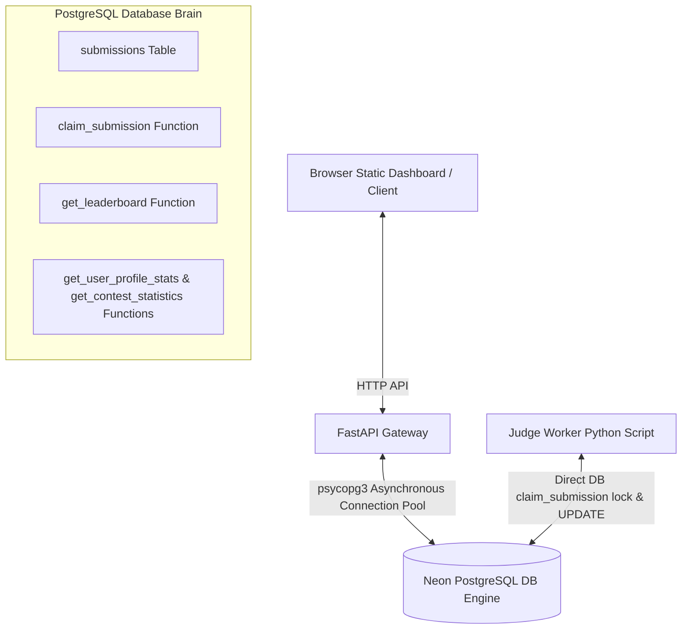
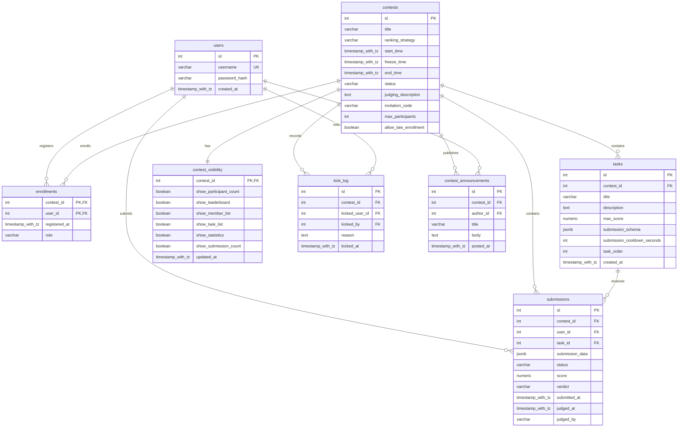

# System Architecture & Entity Relationship Diagram (ERD)

This document describes the current architecture and database design of the ContestDB **Walking Skeleton** (v0.5.0).

---

## 1. System Architecture Diagram

ContestDB is built on a **Thin-Tier Architecture** pattern. The backend server acts only as an interface gateway, while the relational database (PostgreSQL on Neon) coordinates execution, concurrency queues, and score calculations.



### Components Summary:
1. **Client Interface**: A premium styled static dashboard (`static/index.html`) served directly by the backend at `GET /`. It handles authentication states (localStorage) and sends JWT authorization headers for submission actions.
2. **FastAPI Gateway (`backend/app`)**: An asynchronous routing tier. Its primary role is to authenticate users, issue signed JWT tokens, validate incoming inputs (such as verifying user enrollment before queueing a submission), and serialize parameters to and from PostgreSQL.
3. **PostgreSQL Database Engine (`database/`)**: The processing engine of the platform. It handles:
   * **Authentication Hashing**: Compares credentials and registers users natively inside `verify_user_credentials` and `register_user` functions via `pgcrypto`.
   * **Queue State Locking**: Multiple concurrent workers call `claim_submission()` which utilizes `FOR UPDATE SKIP LOCKED` to lock rows atomically without race conditions.
   * **Real-time Standing Calculations**: Standings are calculated dynamically inside `get_leaderboard()` using SQL CTE aggregations, filtered by user visibility roles (applying the scoreboard freeze timestamps).
4. **Judge Worker (`worker/`)**: A separate background script that acts as the evaluator black-box. It polls the database queue directly, performs evaluations on flexible JSONB payloads, and writes standardized scores/verdicts back.

---

## 2. Entity Relationship Diagram (ERD)

The database schema is designed to be highly generic and contest-agnostic, storing custom contest payloads in a flexible `JSONB` column, and managing contest roles and individual tasks natively in the database.



### Tables Specification:

#### `users`
* `id` (SERIAL, PRIMARY KEY): Unique identifier.
* `username` (VARCHAR(50), UNIQUE, NOT NULL): Name of the participant.
* `password_hash` (VARCHAR(255), NOT NULL): Blowfish/bcrypt hash of user password.
* `created_at` (TIMESTAMP WITH TIME ZONE, DEFAULT NOW()): Account creation timestamp.

#### `contests`
* `id` (SERIAL, PRIMARY KEY): Unique identifier.
* `title` (VARCHAR(100), NOT NULL): Name of the contest.
* `ranking_strategy` (VARCHAR(30), NOT NULL): Strategy rule (`'SUM'` or `'MAX'`).
* `start_time` (TIMESTAMP WITH TIME ZONE, NOT NULL): Contest launch.
* `freeze_time` (TIMESTAMP WITH TIME ZONE, NOT NULL): Standing freeze timestamp (public users will not see submissions made after this point).
* `end_time` (TIMESTAMP WITH TIME ZONE, NOT NULL): Contest closure.
* `status` (VARCHAR(30), DEFAULT 'PENDING_APPROVAL', NOT NULL): Approval status (`'PENDING_APPROVAL'`, `'ACTIVE'`, `'COMPLETED'`).
* `judging_description` (TEXT): Description of the scoring and judging logic for the contest developer.
* `invitation_code` (VARCHAR(50), NULLABLE): Invitation code needed to register for private contests.
* `max_participants` (INT, NULLABLE): Enrollment cap. `NULL` = unlimited. When set, `enroll_in_contest()` uses `FOR UPDATE` locking to prevent race conditions at capacity.
* `allow_late_enrollment` (BOOLEAN, DEFAULT TRUE, NOT NULL): If `FALSE`, enrollment is rejected after `start_time` has passed.
* *Constraints*: `chk_contest_times` checks that `freeze_time >= start_time AND end_time >= freeze_time`, `chk_contest_status` validates status values, and `chk_max_participants` ensures `max_participants > 0` when set.

#### `enrollments`
* `contest_id` (INT, FOREIGN KEY, REFERENCES contests(id) ON DELETE CASCADE)
* `user_id` (INT, FOREIGN KEY, REFERENCES users(id) ON DELETE CASCADE)
* `registered_at` (TIMESTAMP WITH TIME ZONE, DEFAULT NOW())
* `role` (VARCHAR(20), DEFAULT 'PARTICIPANT', NOT NULL): User role (`'HOST'`, `'MODERATOR'`, `'PARTICIPANT'`).
* *PrimaryKey*: Combined key `(contest_id, user_id)`.
* *Constraints*: `chk_enrollment_role` restricts roles to HOST, MODERATOR, or PARTICIPANT.

#### `tasks`
* `id` (SERIAL, PRIMARY KEY): Unique task/problem identifier.
* `contest_id` (INT, FOREIGN KEY, REFERENCES contests(id) ON DELETE CASCADE)
* `title` (VARCHAR(100), NOT NULL): Task name.
* `description` (TEXT, NOT NULL): Details/parameters of the task.
* `max_score` (NUMERIC, DEFAULT 100): Maximum score obtainable.
* `submission_schema` (JSONB, NOT NULL): Mandatory payload descriptor. Every task must declare a schema with `required_keys` and optionally `numeric_keys`. Validated by `validate_submission_schema_native()` before a submission is accepted.
* `submission_cooldown_seconds` (INT, DEFAULT 0, NOT NULL): Minimum seconds a user must wait between submissions to this task. `0` = no cooldown.
* `task_order` (INT, DEFAULT 0, NOT NULL): Display ordering index within the contest. Lower = shown first.
* `created_at` (TIMESTAMP WITH TIME ZONE, DEFAULT NOW())

#### `submissions`
* `id` (SERIAL, PRIMARY KEY): Unique identifier.
* `contest_id` (INT, FOREIGN KEY, REFERENCES contests(id) ON DELETE CASCADE)
* `user_id` (INT, FOREIGN KEY, REFERENCES users(id) ON DELETE CASCADE)
* `task_id` (INT, FOREIGN KEY, REFERENCES tasks(id) ON DELETE CASCADE)
* `submission_data` (JSONB, NOT NULL): Holds flexible inputs (e.g. LFR run parameters, chess moves, source code metadata).
* `status` (VARCHAR(20), DEFAULT 'PENDING', NOT NULL): Processing state (`'PENDING'`, `'JUDGING'`, `'COMPLETED'`, `'FAILED'`).
* `score` (NUMERIC, DEFAULT 0, NOT NULL): Standardized score output written back by the worker.
* `verdict` (VARCHAR(50)): Evaluation outcome written back by the worker.
* `submitted_at` (TIMESTAMP WITH TIME ZONE, DEFAULT NOW())
* `judged_at` (TIMESTAMP WITH TIME ZONE, NULLABLE)
* `judged_by` (VARCHAR(50), NULLABLE): Name of the worker instance that compiled the submission.
* *Constraints*: `chk_submission_status` checks that status is one of the four defined states.
* *Indices*: 
  - `idx_submissions_user_time` on `(user_id, submitted_at DESC)` (Optimizes user history timeline queries).
  - `idx_submissions_contest_time` on `(contest_id, submitted_at DESC)` (Optimizes contest submission timeline charting).

---

## Participant Dashboard Workflow

The participant dashboard follows the database-native thin-tier architecture:

```text
Authenticated client
    → GET /dashboards/participant
    → FastAPI validates JWT and extracts user_id
    → get_participant_dashboard(user_id)
    → PostgreSQL calculates and returns one JSONB dashboard object

## 3. PL/pgSQL Function Catalogue (v0.7.0)

| Function | Purpose |
|---|---|
| `search_contests_native(...)` | Case-insensitive substring search and filter constraints for contests |
| `search_users_native(p_query)` | Case-insensitive substring search for users (trigram optimized) |
| `claim_submission(worker_id)` | FOR UPDATE SKIP LOCKED queue claim |
| `get_leaderboard(contest_id, as_admin)` | Time-aware dynamic leaderboard with freeze logic |
| `register_user(username, password)` | pgcrypto bcrypt user registration |
| `verify_user_credentials(username, password)` | pgcrypto bcrypt credential check |
| `create_contest_native(...)` | Creates contest + auto-enrolls HOST + seeds visibility row |
| `approve_contest_native(contest_id)` | Sets status to ACTIVE |
| `update_contest_native(...)` | Updates contest parameters (HOST/MOD) |
| `delete_contest_native(contest_id, user_id)` | Deletes contest (HOST only) |
| `add_task_native(...)` | Adds task with schema to contest (HOST/MOD) |
| `update_task_native(...)` | Updates task and schema (HOST/MOD) |
| `delete_task_native(task_id, user_id)` | Deletes task (HOST/MOD) |
| `enroll_in_contest(contest_id, user_id, code)` | Race-safe enrollment with cap, late, and ban checks |
| `update_contest_member_role(...)` | Updates a member's role (HOST only) |
| `validate_submission_schema_native(task_id, data)` | Hard-validates JSONB submission against task schema |
| `check_submission_cooldown_native(task_id, user_id)` | Enforces per-task submission cooldown |
| `kick_participant_native(...)` | HOST removes participant; logs to kick_log |
| `update_contest_visibility(...)` | HOST/MOD updates visibility flags |
| `get_contest_visibility(contest_id)` | Returns visibility config |
| `get_contest_enrollment_info(contest_id)` | Returns capacity, count, spots, kicked count |
| `post_announcement_native(...)` | HOST/MOD posts an announcement |
| `delete_announcement_native(...)` | HOST/MOD deletes an announcement |
| `get_contest_profile(contest_id, viewer_id)` | Full profile aggregator (single DB query) |
| `get_user_profile_stats(user_id)` | User statistics aggregator |
| `get_user_activity_graph(user_id)` | Submission count by date |
| `get_user_contest_history(user_id)` | Contest participation history with rank |
| `get_user_submission_history(user_id, limit)` | Recent submission log |
| `get_contest_statistics(contest_id, as_admin)` | Contest-wide analytics with task stats |
| `get_contest_submission_timeline(contest_id, as_admin)` | date_bin bucketed timeline |
| `get_participant_score_progression(contest_id, user_id)` | Cumulative score timeline |
| get_participant_dashboard(p_user_id) | Returns the authenticated participant's summary, ongoing contests, upcoming contests, ranks, scores, and five most recent submissions as JSONB |
