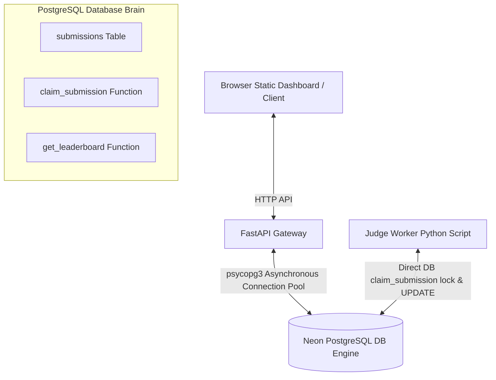
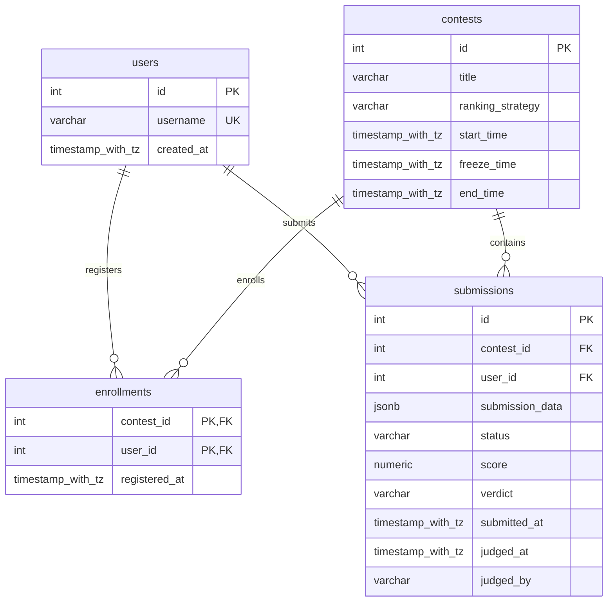

# System Architecture & Entity Relationship Diagram (ERD)

This document describes the current architecture and database design of the ContestDB **Walking Skeleton** (v0.1.3).

---

## 1. System Architecture Diagram

ContestDB is built on a **Thin-Tier Architecture** pattern. The backend server acts only as an interface gateway, while the relational database (PostgreSQL on Neon) coordinates execution, concurrency queues, and score calculations.

### Components Summary:
1. **Client Interface**: A barebones static dashboard (`static/index.html`) served directly by the backend at `GET /`. It interacts with API endpoints to submit JSON payloads and view leaderboards.
2. **FastAPI Gateway (`backend/app`)**: An asynchronous routing tier. Its primary role is to validate incoming inputs (such as verifying user enrollment before queueing a submission) and serialize parameters to and from PostgreSQL.
3. **PostgreSQL Database Engine (`database/`)**: The processing engine of the platform. It handles:
   * **Queue State Locking**: Multiple concurrent workers call `claim_submission()` which utilizes `FOR UPDATE SKIP LOCKED` to lock rows atomically without race conditions.
   * **Real-time Standing Calculations**: Standings are calculated dynamically inside `get_leaderboard()` using SQL CTE aggregations, filtered by user visibility roles (applying the scoreboard freeze timestamps).
4. **Judge Worker (`worker/`)**: A separate background script that acts as the evaluator black-box. It polls the database queue directly, performs evaluations on flexible JSONB payloads, and writes standardized scores/verdicts back.

---

## 2. Entity Relationship Diagram (ERD)

The database schema is designed to be highly generic and contest-agnostic, storing custom contest payloads in a flexible `JSONB` column.

### Tables Specification:

#### `users`
* `id` (SERIAL, PRIMARY KEY): Unique identifier.
* `username` (VARCHAR(50), UNIQUE, NOT NULL): Name of the participant.
* `created_at` (TIMESTAMP WITH TIME ZONE, DEFAULT NOW()): Account creation timestamp.

#### `contests`
* `id` (SERIAL, PRIMARY KEY): Unique identifier.
* `title` (VARCHAR(100), NOT NULL): Name of the contest.
* `ranking_strategy` (VARCHAR(30), NOT NULL): Strategy rule (`'SUM'` or `'MAX'`).
* `start_time` (TIMESTAMP WITH TIME ZONE, NOT NULL): Contest launch.
* `freeze_time` (TIMESTAMP WITH TIME ZONE, NOT NULL): Standing freeze timestamp (public users will not see submissions made after this point).
* `end_time` (TIMESTAMP WITH TIME ZONE, NOT NULL): Contest closure.
* *Constraints*: `chk_contest_times` checks that `freeze_time >= start_time AND end_time >= freeze_time`.

#### `enrollments`
* `contest_id` (INT, FOREIGN KEY, REFERENCES contests(id) ON DELETE CASCADE)
* `user_id` (INT, FOREIGN KEY, REFERENCES users(id) ON DELETE CASCADE)
* `registered_at` (TIMESTAMP WITH TIME ZONE, DEFAULT NOW())
* *PrimaryKey*: Combined key `(contest_id, user_id)`.

#### `submissions`
* `id` (SERIAL, PRIMARY KEY): Unique identifier.
* `contest_id` (INT, FOREIGN KEY, REFERENCES contests(id) ON DELETE CASCADE)
* `user_id` (INT, FOREIGN KEY, REFERENCES users(id) ON DELETE CASCADE)
* `submission_data` (JSONB, NOT NULL): Holds flexible inputs (e.g. LFR run parameters, chess moves, source code metadata).
* `status` (VARCHAR(20), DEFAULT 'PENDING', NOT NULL): Processing state (`'PENDING'`, `'JUDGING'`, `'COMPLETED'`, `'FAILED'`).
* `score` (NUMERIC, DEFAULT 0, NOT NULL): Standardized score output written back by the worker.
* `verdict` (VARCHAR(50)): Evaluation outcome written back by the worker.
* `submitted_at` (TIMESTAMP WITH TIME ZONE, DEFAULT NOW())
* `judged_at` (TIMESTAMP WITH TIME ZONE, NULLABLE)
* `judged_by` (VARCHAR(50), NULLABLE): Name of the worker instance that compiled the submission.
* *Constraints*: `chk_submission_status` checks that status is one of the four defined states.
